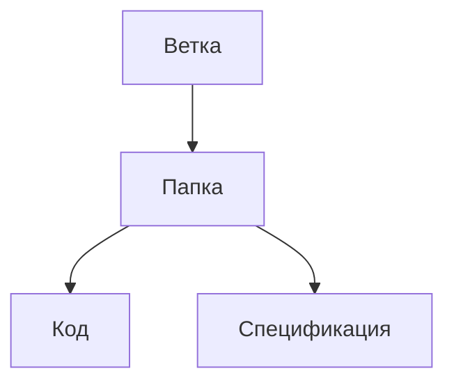

# MPEI_Prog_Labs
Цель данного репозитория заключается в обеспечении возможности совместного выполнения лабораторных работ по программированию.

## Структура

**Ветка**:  представляет собой отдельную ветку разработки, которая содержит набор папок.  Название ветки формируется из номера варианта соответствующего студента группы.

**Папка**: имеет два основных файла:  код лабораторной работы и спецификацию к данной работе. Название папка формируется по принципу "Лабораторная № _<число>_"

**Код**: содержит соответствующий синтаксис языка программирования и выполняет поставленную задачу.

**Спецификация**: является текстовым документом, описывающий лабораторную работу. Включает в себя следующие разделы:

        - Постановка задачи
        - Уточненная постановка задачи (УПЗ)
        - Типы данных
        - Входная форма
        - Выходная форма
        - Аномалии
        - Тестовые примеры
        - Метод
        - Алгоритм
        - Программа
Набор данных параметров может отличаться в зависимости от требований преподавателя.

